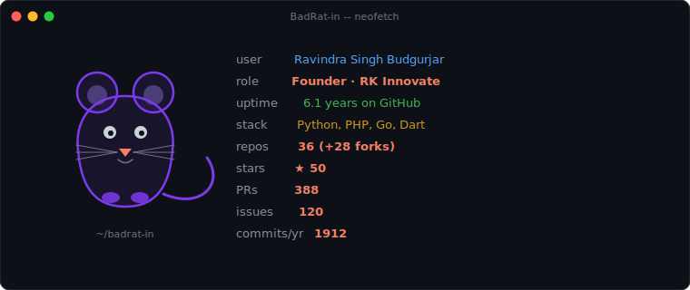
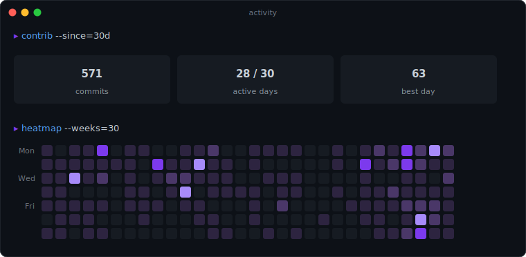
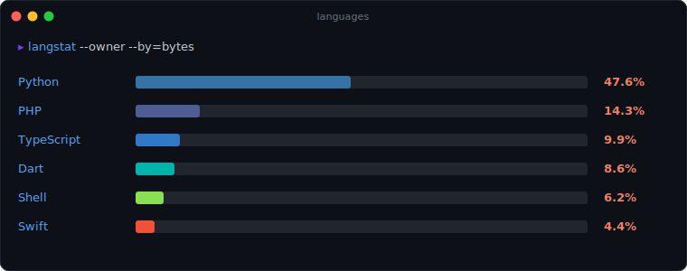
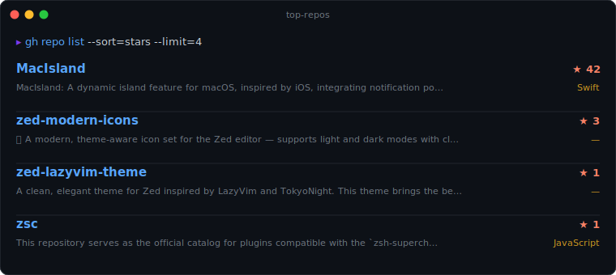

<h1 align="center">Ravindra Singh Budgurjar</h1>

  Full-Stack Developer · Solution Architect · Founder of <a href="https://github.com/RKInnovate">RK Innovate</a>
   
  Building developer tools, AI products, and healthcare platforms — from India 🇮🇳

  
  
  
  

---

### About

I architect and ship products end-to-end — from system design to the last pixel. My focus is on tools that respect their users: fast, native-feeling, and free of unnecessary friction.

- 🔨 Currently building at **[RK Innovate](https://github.com/RKInnovate)**
- 🧪 Exploring developer tooling, on-device AI, and macOS/Linux native UX
- 🤝 Open to collaborating on focused open-source work

### Selected work

| | |
|---|---|
| **[MacIsland](https://github.com/BadRat-in/MacIsland)** | A Dynamic Island for macOS — notifications, battery, media, all in one floating UI. |
| **[Zed Modern Icons](https://github.com/BadRat-in/zed-modern-icons)** | A theme-aware icon set for the Zed editor. Light & dark, developer-friendly. |
| **[Zed LazyVim Theme](https://github.com/BadRat-in/zed-lazyvim-theme)** | LazyVim / TokyoNight aesthetic ported to Zed. |
| **[RK Innovate](https://github.com/RKInnovate)** | Products and platforms built by the team. |

### Stack

`TypeScript` · `Python` · `Rust` · `Swift` · `Dart` · `Go` ·
`React` · `Flutter` · `Django` · `FastAPI` · `GCP` · `AWS`

---

### Stats

  

  

  

  

